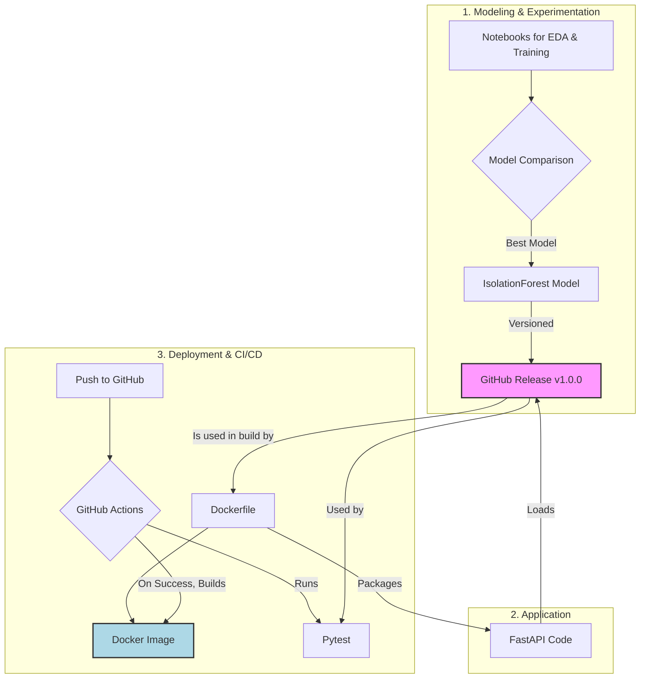

# End-to-End MLOps: Real-time Anomaly Detection API

This repository contains an end-to-end MLOps project that builds, tests, and containerizes a real-time anomaly detection API using time-series data.

## Table of Contents

- [Project Overview](#project-overview)
- [Dataset](#dataset)
- [System Architecture](#system-architecture)
- [Project Structure](#project-structure)
- [Jupyter Notebooks](#jupyter-notebooks)
- [Installation and Usage](#installation-and-usage)
- [API Usage](#api-usage)
- [Model Performance](#model-performance)
- [Author](#author)

## Project Overview

This project implements a robust system for identifying anomalies in CPU utilization data. The primary goal is to demonstrate a full MLOps lifecycle, showcasing best practices in:
-   Comparative model development (`IsolationForest` vs. `LSTM Autoencoder`).
-   REST API development with FastAPI.
-   Automated testing with Pytest.
-   Dependency and environment management with Poetry.
-   Containerization with Docker.
-   CI/CD automation with GitHub Actions.
-   Artifact management with GitHub Releases.

## Dataset

The **Numenta Anomaly Benchmark (NAB)** dataset is used, specifically the real-world time-series data for EC2 CPU utilization. This dataset provides labeled anomalies, making it ideal for supervised evaluation of unsupervised models.

-   **Source:** [Numenta Anomaly Benchmark on GitHub](https://github.com/numenta/NAB)
-   **Project Usage:** The file `realAWSCloudwatch/ec2_cpu_utilization_24ae8d.csv` is used for training and evaluation.

## System Architecture

The diagram below illustrates the end-to-end architecture of the MLOps pipeline.



## Project Structure

```
real-time-anomaly-detection/
├── .github/
│   └── workflows/
│       └── ci.yml            
├── data/
│   └── raw/
│       └── NAB-master/       
├── models/
│   ├── isolation_forest_baseline_v1.joblib
│   └── lstm_autoencoder_v1.h5
├── notebooks/
│   ├── 01_eda.ipynb
│   ├── 02_baseline_model_training.ipynb
│   └── 03_advanced_model_LSTM.ipynb
├── results/
│   ├── 01_eda_cpu_utilization_with_anomalies.png
│   ├── 02_confusion_matrix_isolation_forest.png
│   └── 03_confusion_matrix_lstm.png
├── src/
│   ├── api/
│   │   └── main.py           
│   ├── config.py
│   └── predict.py
├── tests/
│   └── test_api.py          
├── .dockerignore
├── .gitignore
├── Dockerfile                
├── LICENSE
├── poetry.lock
├── pyproject.toml          
└── pytest.ini
```

## Jupyter Notebooks

| Step | Notebook | Description |
| :--- | :--- | :--- |
| **1. EDA** | [01_eda.ipynb](notebooks/01_eda.ipynb) | Loads and visualizes the time-series data and labeled anomalies. |
| **2. Baseline Model** | [02_baseline_model_training.ipynb](notebooks/02_baseline_model_training.ipynb) | Trains, evaluates, and saves a baseline `IsolationForest` model. |
| **3. Advanced Model** | [03_advanced_model_LSTM.ipynb](notebooks/03_advanced_model_LSTM.ipynb) | Develops, trains, and evaluates an `LSTM Autoencoder`. Concludes with a comparative analysis. |

## Installation and Usage

This application is containerized and is the recommended way to run it.

### Prerequisites
-   Docker Desktop installed and running.

### Running with Docker

1.  **Clone the repository:**
    ```bash
    git clone https://github.com/Gomes-Gustavo/real-time-anomaly-detection.git
    cd real-time-anomaly-detection
    ```

2.  **Build the Docker image:**
    The model artifact is downloaded automatically from the GitHub Release during the build.
    ```bash
    docker build -t anomaly-detection-api .
    ```

3.  **Run the Docker container:**
    ```bash
    docker run -d -p 8080:80 --name anomaly-api anomaly-detection-api
    ```

4.  **The API is now running!**
    -   Access the interactive documentation at `http://localhost:8080/docs`.
    -   Check the status at `http://localhost:8080`.

## API Usage

The API has one main endpoint for predictions: `POST /predict`. Send a `POST` request with a single CPU utilization value to get an anomaly prediction.

#### Normal Value (`value: 0.13`)
```bash
curl -X 'POST' 'http://localhost:8080/predict' -H 'Content-Type: application/json' -d '{"value": 0.13}'
```
**Expected Response:** `{"is_anomaly":false,"predicted_value":1}`

#### Anomalous Value (`value: 95.0`)
```bash
curl -X 'POST' 'http://localhost:8080/predict' -H 'Content-Type: application/json' -d '{"value": 95.0}'
```
**Expected Response:** `{"is_anomaly":true,"predicted_value":-1}`

## Model Performance

A key part of this project was comparing a classical ML model with a deep learning approach to select the best solution.

| Model | Precision (Anomaly) | Recall (Anomaly) | F1-Score (Anomaly) | Key Insight |
| :--- | :---: | :---: | :---: | :--- |
| **`IsolationForest`** | **1.00** | **0.50** | **0.67** | Excellent at identifying extreme point anomalies without false alarms. |
| **`LSTM Autoencoder`** | 0.00 | 0.00 | 0.00 | Failed to distinguish anomalies, as their temporal pattern was not distinct enough. |

**Conclusion**: The simpler `IsolationForest` was the superior and more efficient engineering choice for this specific problem, where anomalies are characterized by magnitude rather than context.

## Author

Developed by Gustavo Gomes

- [LinkedIn](https://www.linkedin.com/in/gustavo-gomes-581975333/)
- [gustavo.agomes@outlook.com](mailto:gustavo.agomes@outlook.com)
